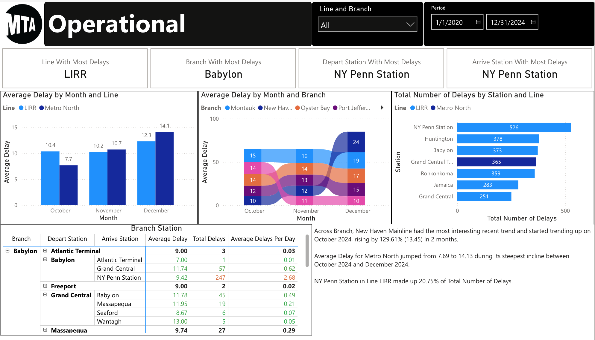
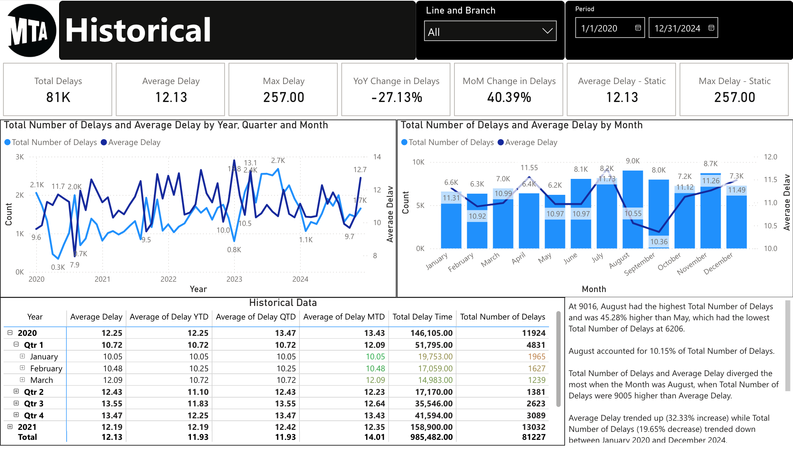

# Metropolitan Transportation Authority (MTA) Train Delay Analysis Dashboard

**Capstone Project – BIA 5450: Business Insights and Analytics**  

---

## Project Overview

This project addresses persistent train delays within the Metropolitan Transportation Authority (MTA), with a focus on the Long Island Railroad (LIRR) and Metro-North Railroad. By analyzing five years of publicly available data (2020–2024), an interactive Power BI dashboard was developed to support operational decision-making, reduce delays, and enhance commuter experience.

---

## Objectives

- Identify trends, causes, and severity of train delays across lines, stations, and time periods.
- Equip the MTA with actionable insights to improve scheduling and resource deployment.
- Deliver a scalable dashboard solution for both historical analysis and operational monitoring.

---

## Tools and Technologies

- Power BI – Data visualization and dashboard development
- Power Query – Data extraction, cleaning, and transformation
- DAX (Data Analysis Expressions) – Calculated columns and KPIs
- Star Schema Design – Data modeling for performance and scalability
- OneDrive – Cloud-based storage and collaboration

---

## Methodology

### Data Preparation
- Collected datasets from the New York State Open Data Portal.
- Cleaned and standardized records, handled missing values, removed duplicates.
- Created new variables including day type, seasonal classification, and delay severity levels.

### Data Modeling
- Constructed a star schema with one fact table and ten dimension tables.
- Defined calculated measures and columns to support trend and performance analysis.

### Dashboard Development
- Developed a multi-page Power BI dashboard, including:
  - Overview Report
  - Historical Trends
  - Calendar-Based Analysis
  - Operational Metrics
  - Delay Category Analysis

### Testing and Optimization
- Validated metric accuracy against raw data and Excel calculations.
- Improved responsiveness through column pruning, DAX optimization, and incremental data refresh.
- Enhanced user experience with interactive visuals, filters, and navigational flow.

---

## Key Outcomes

- Delivered a fully interactive Power BI dashboard covering MTA commuter delay data from 2020 to 2024.
- Identified high-delay lines, peak disruption times, and major contributing factors.
- Enabled data-driven insights for operational efficiency and improved commuter service.

---

## Future Enhancements

- Integration with real-time APIs for live delay tracking.
- Implementation of smart alerts and automated notifications.
- Role-based access for customized views per department.
- Mobile-responsive layout for field use.

---
### Operational Report

This report focuses on operational insights by station, line, and delay category. It highlights the most delayed stations and branches, along with monthly delay trends.

---

### Historical Report

This report presents long-term trends in delay volume and severity from 2020 to 2024, including year-over-year and month-over-month comparisons.

